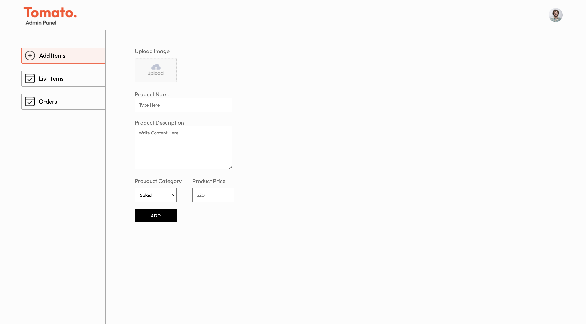

# Tomato - Food Ordering Website

Tomato is a full-stack food ordering website built using the MERN stack (MongoDB, Express, React, Node.js). It features secure payments via Stripe, user authentication, and an admin dashboard for managing the order menu and controlling the status of orders.

## 🌟 Features

- **User Authentication**: Users can sign up and log in securely.
- **Food Menu**: Users can browse a menu of available dishes and add them to their cart.
- **Order Management**: Admins can add, update, or delete items from the menu. Admins can also change the status of customer orders.
- **Stripe Integration**: Secure payment processing using the Stripe API.
- **Admin Dashboard**: A dedicated admin page to manage orders and menu items.
  
## 🛠️ Tech Stack

- **Frontend**: React.js, CSS
- **Backend**: Node.js, Express.js
- **Database**: MongoDB
- **Authentication**: JWT (JSON Web Tokens)
- **Payments**: Stripe API

## 🚀 Getting Started

Follow these instructions to set up the project locally.

### Prerequisites

Make sure you have the following installed on your local development machine:

- Node.js (>= v14.x)
- MongoDB
- Stripe account and API keys
- Git

### Installation

1. Clone the repository:

   ```bash
   git clone https://github.com/atharvasakpal/Tomato.git
   cd Tomato
    ```
2 .Install dependencies for both the frontend and backend:

  ```bash
    # For backend
cd backend
npm install

# For frontend
cd ../frontend
npm install
  ```
3. Set up environment variables:
Create a .env file in the root of both the frontend and backend directories with the following variables:

Backend (/backend/.env):
```.env
MONGO_URL=your_mongodb_connection_string
JWT_SECRET=your_jwt_secret
STRIPE_SECRET_KEY=your_stripe_secret_key
```
Frontend (/frontend/.env):
```.env
REACT_APP_STRIPE_PUBLIC_KEY=your_stripe_public_key
```
4. Run MongoDB:
If you're running MongoDB locally, start the MongoDB server:
```bash
mongod
```

5.Start the development servers:
**Backend:**
```bash
cd backend
npm run dev
```

**Frontend:**

```bash
cd frontend
npm start
```

**Admin:**
```bash
cd admin
npm start
```

6.Access the app:

The frontend will be available at http://localhost:3000 and the admin page at http://localhost:3001 the backend at http://localhost:4000.

## ⚙️ Usage

User Features:
- **Sign up:** Users can register for an account.
- **Log in:** Users can log in and access their order history.
- **Browse menu:** Users can browse through available food items.
- **Add to cart:** Users can add items to the cart and proceed to checkout.
- **Make payment:** Secure payments are handled by Stripe.
- **Order tracking:** Users can track the status of their orders.

Admin Features:
- **Add/Edit/Delete menu items:** Admins can manage the food items displayed on the menu.
- **View orders:** Admins can view a list of all orders.
- **Update order status:** Admins can update the status of an order (e.g., "Preparing", "Out for Delivery", "Delivered").

## 📸 Screenshots

## User-Side:


## Admin-Side:



